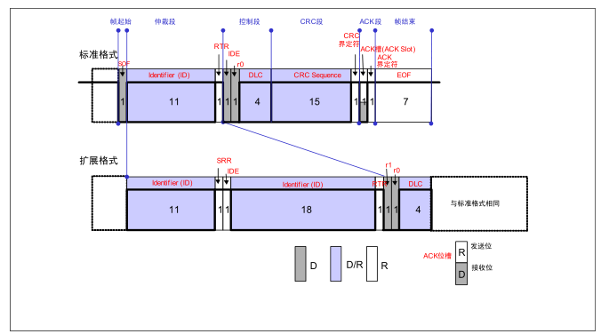
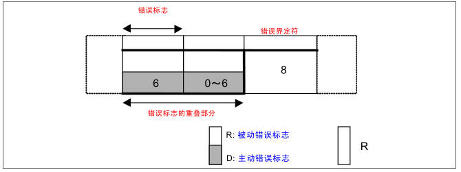
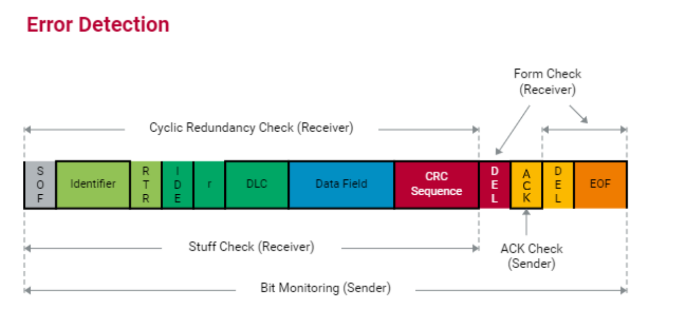

# CAN（Controller Area Network）

### 1.1 CAN特点

##### ① 多主控制

发消息，发送权（CSMA/CA: Carrier Sense Multiple Access / Collision Avoidance）

##### ② 消息的发送

根据标识符决定优先级进行抢占式的发消息（通过仲裁段来进行优先级对比）

##### ③ 系统的柔软性

总线上添加单元时不会影响IOS/OSI的上层

##### ④ 通行速度

同一网络速度一致，不同网络速度可不一致

##### ⑤ 远程数据请求

"遥控帧"，请求发送

##### ⑥ 错误检测，错误通知，错误恢复

所有节点都有独立检错功能

检测到错误后都会立即通知其他功能

检测出错误停止发送，然后不停的重发直至成功

##### ⑦ 故障封闭

可以根据节点错误的**暂时性**还是**持续性**错误来进行限制隔离

##### ⑧ 连接

多连接，通信速度与连接单元数量成反比

### 1.2 错误

##### （1）主动错误状态

会积极的发送错误标志

##### （2）被动错误状态

不会很积极的发送错误通知，并且下次发送开始会在间隔帧插入“延迟传送”(8 个位的隐性位)

##### （3）总线关闭态

发送接收都禁止

#### 错误计数规则

### 1.3 CAN协议的基本概念

数据链路层分为 MAC 子层和 LLC 子层，MAC 子层是 CAN 协议的核心部分。数据链路层的功能是将物理层收到的信号组织成有意义的消息，并提供传送错误控制等传输控制的流程。具体地说，就是消息的帧化、仲裁、应答、错误的检测或报告。数据链路层的功能通常在 CAN 控制器的硬件中执行。

### 1.4 CAN协议及标准规格

11898-1对应controller

11898-2对应高速can收发器

11898-3对应低速can收发器

11898-4增加了时间触发通讯机制

#### 发送器和接受器（低速和高速）

0~125kbps 不需要终端电阻

0~1Mbps 需要终端电阻

### 1.5 CAN协议

#### 帧的种类

**① 数据帧**

其中ID标准有11位，从ID28到ID18依次发送 （禁止：ID = 1111111XXXX）

拓展格式有29位，除了基本还有ID17 到ID0 （禁止：ID = 1111111XXXX）

DLC （4位）只表示 0 ~ 8 

例如RDDD 表示1000 = 8（R = recessive隐性 D = dominant显性）

**② 遥控帧（远程帧）**

**③ 错误帧**

——主动错误标志：6 个位的显性位。
——被动错误标志：6 个位的隐性位。

**④ 过载帧**

**⑤ 帧间隔**

### 1.6 总线竞争

通过判断总线电平显性&发送电平隐性说明竞争失败，转到接受状态

#### 位填充

### 1.7 错误的种类

(1) 位错误
——位错误由向总线上输出数据帧、遥控帧、错误帧、过载帧的单元和输出 ACK 的单元、输出错误的单元来检测。
——在仲裁段输出隐性电平，但检测出显性电平时，将被视为仲裁失利，而不是位错误。
——在仲裁段作为填充位输出隐性电平时，但检测出显性电平时，将不视为位错误，而是填充错误。
——发送单元在 ACK 段输出隐性电平，但检测到显性电平时，将被判断为其它单元的 ACK 应答，而非位错误。
——输出被动错误标志（6 个位隐性位）但检测出显性电平时，将遵从错误标志的结束条件，等待检测出连续相同 6 个位的值（显性或隐性），并不视为位错误。
(2) 格式错误
——即使接收单元检测出 EOF（7 个位的隐性位）的最后一位（第 8 个位）为显性电平，也不视为格式错误。
—— 即使接收单元检测出数据长度码（DLC）中 9∼15 的值时，也不视为格式错误。

### 1.8 错误帧输出

### 1.9 位时序

发送单元每秒钟发送的位数为位速率，一位分为4段，每段又可分为若干个Tq（Time Quantum），位时序

### 1.10 硬件同步

### 1.11 再同步

SJW 重新同步跳跃宽度

### 1.12 调整同步的规则

**(1) 1 个位中只进行一次同步调整。
(2) 只有当上次采样点的总线值和边沿后的总线值不同时，该边沿才能用于调整同步。
(3) 在总线空闲且存在隐性电平到显性电平的边沿时，则一定要进行硬件同步。
(4) 在总线非空闲时检测到的隐性电平到显性电平的边沿如果满足条件（1）和（2），将进行再同步。但还要满足下面条件。
(5) 发送单元观测到自身输出的显性电平有延迟时不进行再同步。
(6) 发送单元在帧起始到仲裁段有多个单元同时发送的情况下，对延迟边沿不进行再同步。**

test

