## 国标GBT 32960-2016

#### 数据包结构和定义

##### 数据类型

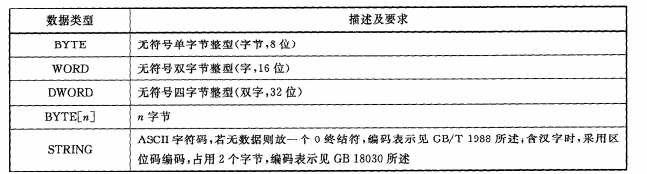

##### 数据包结构

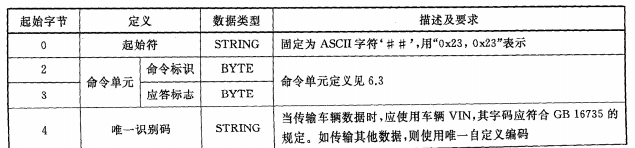

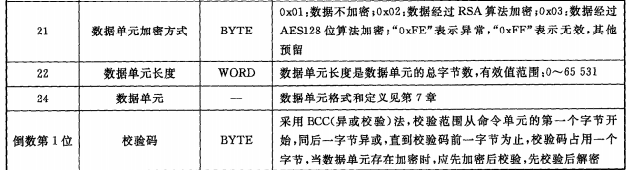

##### 命令单元

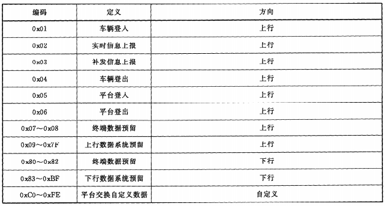

##### 应答标识

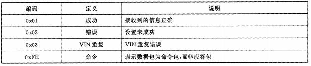

##### 时间

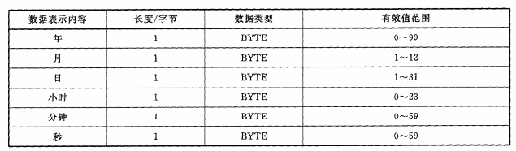

##### 数据单元格式和定义

###### 车辆登入

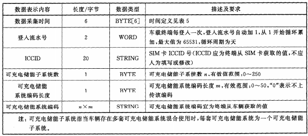

###### 实时信息上报

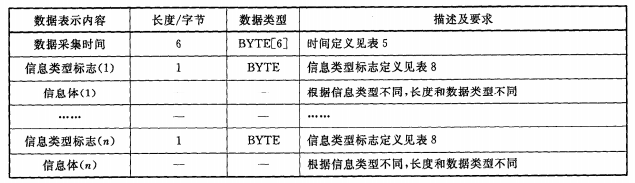

###### 信息类型标志

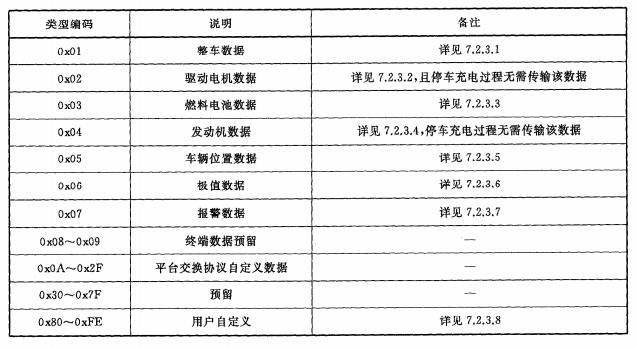

###### 整车数据

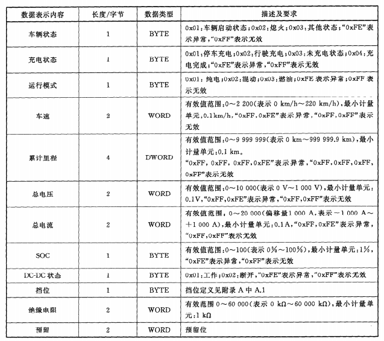

###### 驱动电机数据

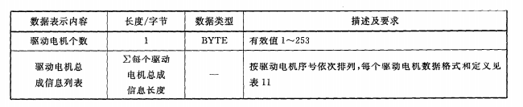

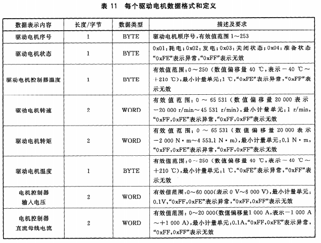

###### 燃料电池数据

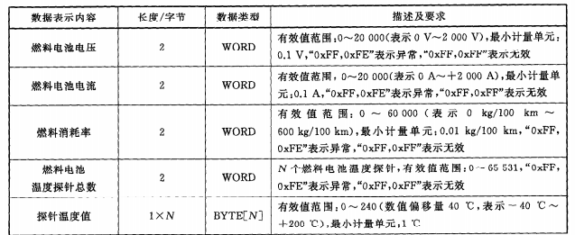

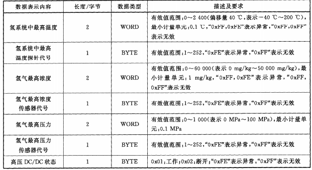

###### 发动机数据

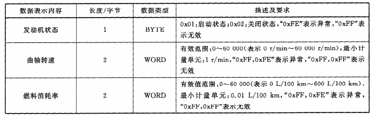

###### 车辆位置数据

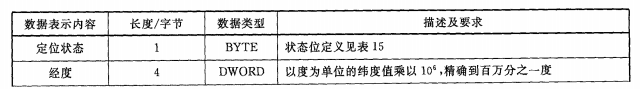

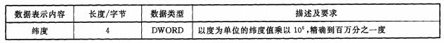

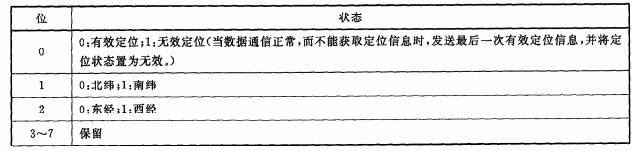

###### 极值数据

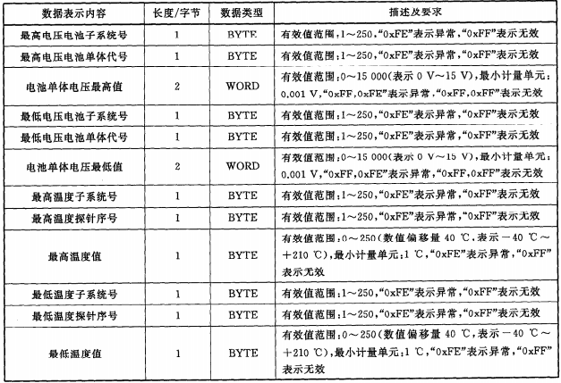

###### 报警数据

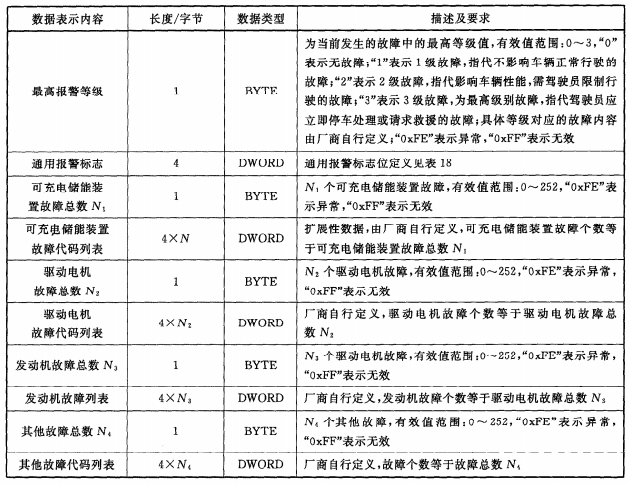

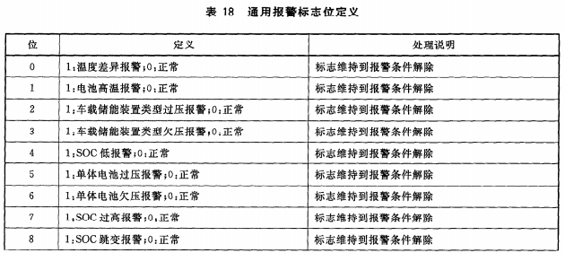

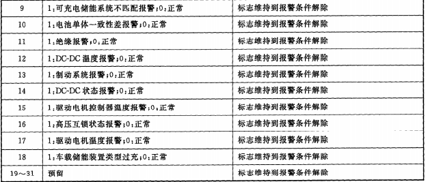

###### 自定义数据

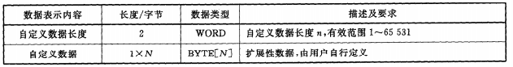

###### 车辆登出

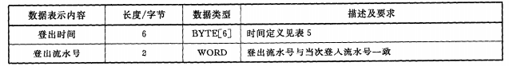

###### 平台登入

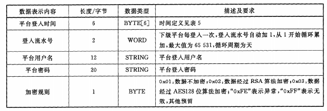

###### 平台登出

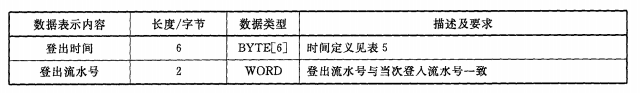

### 附录A（部分字段定义）

###### 挡位状态位定义

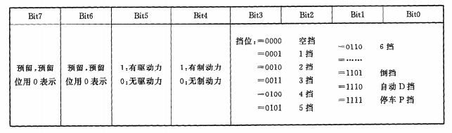

###### 车辆静态信息

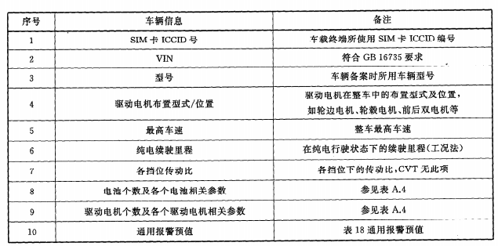

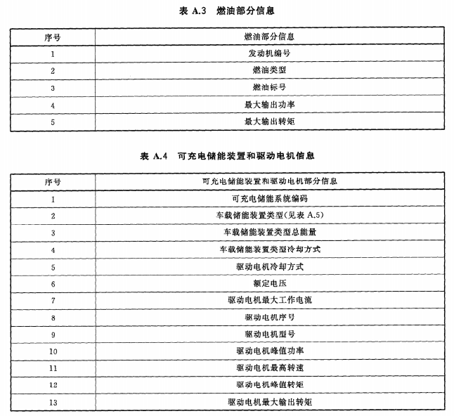

###### 车载储能装置类型代码定义

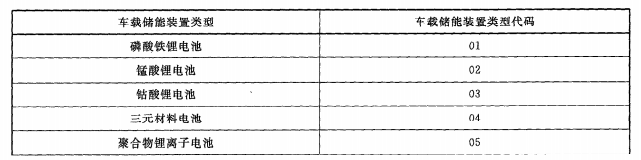

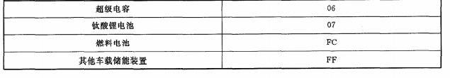

### 附录B（车载终端到平台的通信协议）

##### 连接建立

未收到应答3min后重发，连续重复三次登入无应答，30min后再重新链接

##### 实时信息上报

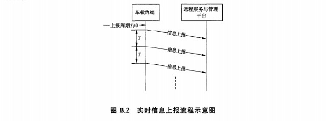

##### 参数查询

##### 参数设置

##### 车载终端控制

##### 终端校时

##### 数据包结构和定义

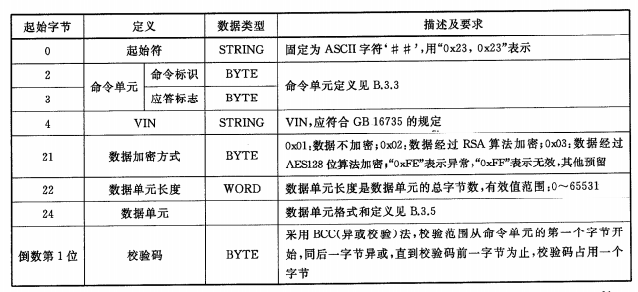

##### 命令单元

###### 命令标识

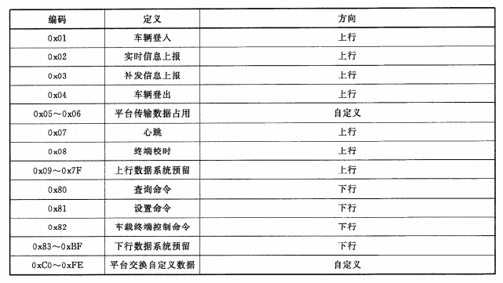

##### 数据单元格式和定义

###### 数据类型标志

###### 整车数据

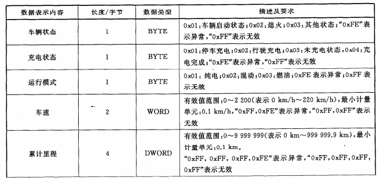

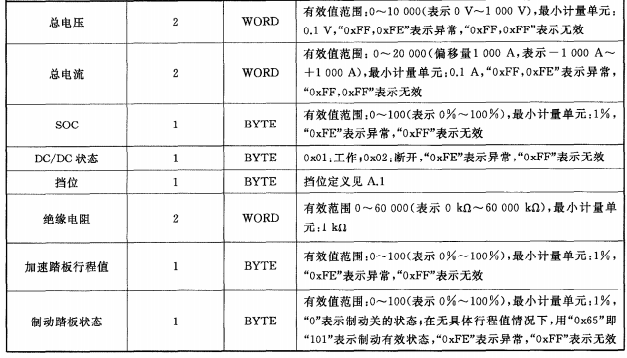

###### 可充电储能装置电压数据

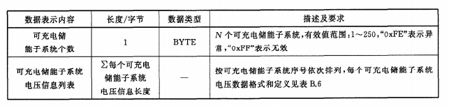

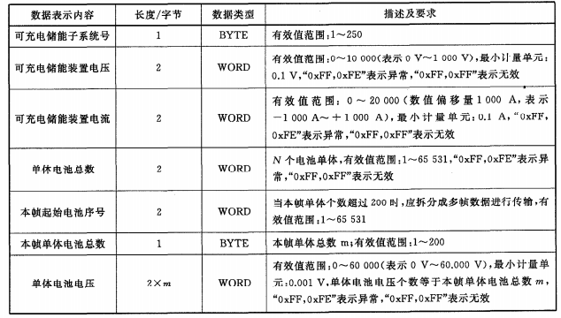

###### 可充电储能装置温度数据

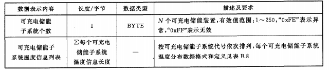

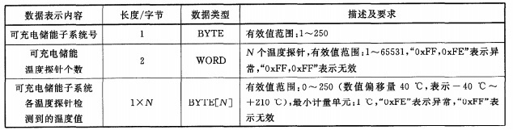

###### 参数查询

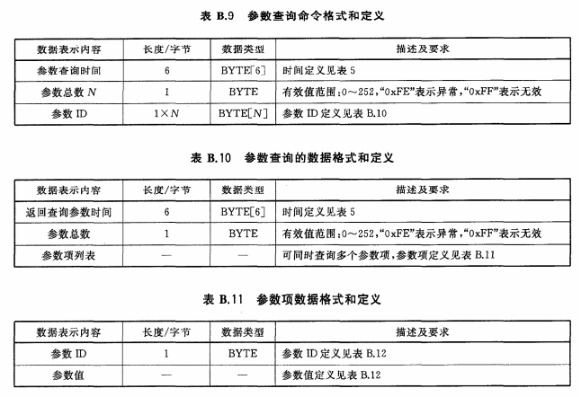

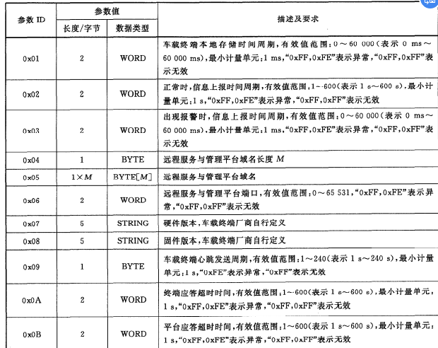

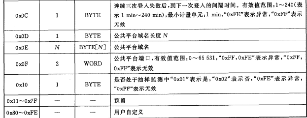

###### 参数设置

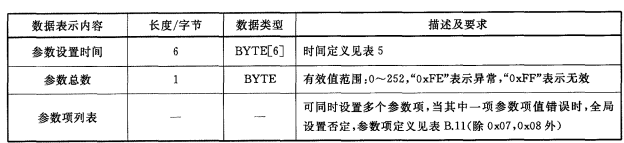

###### 车载终端控制

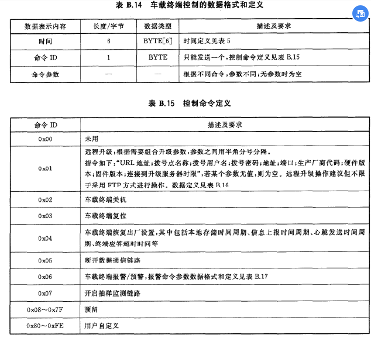

