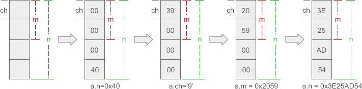

# 看代码时的拓展

## Fork()

创建进程，两个进程代码完全一致，但是传入的初始参数或者传入的变量不同，两个进程就可以做不同的事情。（从fork()调用时把后面所有的代码复制到新进程）

fork()在父进程时返回子进程的ID， 子进程fork()返回0：进程形成了链表，父进程的fpid(p 意味point)指向子进程的进程id，因为子进程没有子进程，所以其fpid为0。

## 守护进程（Daemon Process）

### 什么是守护进程？

[守护进程（Daemon Process）](http://baike.baidu.com/link?url=IcWqjC9d2Seh1YbNmbv4RdTbQ6PHDjQrqU1mxoTCalSOGlTm1ehoJIYnxVEgAqTDByUfSlH7rMdat00N1IKJva)，也就是通常说的 Daemon 进程（精灵进程），是 Linux 中的后台服务进程。它是一个生存期较长的进程，通常独立于控制终端并且周期性地执行某种任务或等待处理某些发生的事件。

[守护进程](http://baike.baidu.com/link?url=IcWqjC9d2Seh1YbNmbv4RdTbQ6PHDjQrqU1mxoTCalSOGlTm1ehoJIYnxVEgAqTDByUfSlH7rMdat00N1IKJva)是个特殊的[孤儿进程](http://blog.csdn.net/tennysonsky/article/details/45969569)，这种进程脱离终端，**为什么要脱离终端呢？**之所以脱离于终端是为了避免进程被任何终端所产生的信息所打断，其在执行过程中的信息也不在任何终端上显示。由于在 Linux 中，每一个系统与用户进行交流的界面称为终端，每一个从此终端开始运行的进程都会依附于这个终端，这个终端就称为这些进程的控制终端，当控制终端被关闭时，相应的进程都会自动关闭。

**Linux 的大数服务器**就是用守护进程实现的。比如，Internet 服务器 inetd，Web 服务器 httpd 等。

### 如何查看守护进程

在终端敲：`ps axj`

- a 表示不仅列当前用户的进程，也列出所有其他用户的进程
- x 表示不仅列有控制终端的进程，也列出所有无控制终端的进程
- j 表示列出与作业控制相关的信息

- 守护进程基本上都是以超级用户启动（ UID 为 0 ）
- 没有控制终端（ TTY 为 ？）
- 终端进程组 ID 为 -1 （ TPGID 表示终端进程组 ID）

### 编写守护进程

1）**屏蔽一些控制终端操作的信号**

这是为了防止守护进行在没有运行起来前，控制终端受到干扰退出或挂起。关于信号的更详细用法，[请看《信号中断处理》](http://blog.csdn.net/lianghe_work/article/details/46804469)。

2）**在后台运行**

这是为避免挂起控制终端将守护进程放入后台执行。方法是在进程中调用 fork() 使父进程终止， 让守护进行在子进程中后台执行。

3）**脱离控制终端、登录会话和进程组**

有必要先介绍一下 Linux 中的**进程与控制终端，登录会话和进程组之间的关系**：进程属于一个进程组，进程组号（GID）就是进程组长的进程号（PID）。登录会话可以包含多个进程组。这些进程组共享一个控制终端。这个控制终端通常是创建进程的 shell 登录终端。 控制终端、登录会话和进程组通常是从父进程继承下来的。**我们的目的就是要摆脱它们 ，使之不受它们的影响**。因此需要调用 `setsid()` 使子进程成为新的会话组长，示例代码如下：

`setsid()` 调用成功后，进程成为新的会话组长和新的进程组长，并与原来的登录会话和进程组脱离。由于会话过程对控制终端的独占性，进程同时与控制终端脱离。

4）**禁止进程重新打开控制终端**

现在，进程已经成为无终端的会话组长，**但它可以重新申请打开一个控制终端**。可以通过使进程不再成为会话组长来禁止进程重新打开控制终端，采用的方法是再次创建一个子进程

5）**关闭打开的文件描述符**

进程从创建它的父进程那里继承了打开的文件描述符。如不关闭，将会浪费系统资源，造成进程所在的文件系统无法卸下以及引起无法预料的错误。

6）**改变当前工作目录**

进程活动时，其工作目录所在的文件系统不能卸下。一般需要将工作目录改变到根目录。对于需要转储核心，写运行日志的进程将工作目录改变到特定目录如 `/tmp`。

7）**重设文件创建掩模**

进程从创建它的父进程那里继承了文件创建掩模。它可能修改守护进程所创建的文件的存取权限。为防止这一点，将文件创建掩模清除：

8）**处理 SIGCHLD 信号**

但对于某些进程，特别是服务器进程往往在请求到来时生成子进程处理请求。如果父进程不等待子进程结束，子进程将成为僵尸进程（zombie）从而占用系统资源（关于僵尸进程的更多详情，[请看《僵尸进程》](http://blog.csdn.net/lianghe_work/article/details/46803445)）。如果父进程等待子进程结束，将增加父进程的负担，影响服务器进程的并发性能。在 Linux 下可以简单地将 SIGCHLD 信号的操作设为 SIG_IGN 。关于信号的更详细用法，[请看《信号中断处理》](http://blog.csdn.net/lianghe_work/article/details/46804469)。

## C 语言

### C 库函数 - memcpy()

```
void *memcpy(void *str1, const void *str2, size_t n)
```

### C 库宏 - assert()

C 库宏 `void assert(int expression)` 允许诊断信息被写入到标准错误文件中。换句话说，它可用于在 C 程序中添加诊断。

**expression** -- 这可以是一个变量或任何 C 表达式。如果 **expression** 为 TRUE，assert() 不执行任何动作。如果 **expression** 为 FALSE，assert() 会在标准错误 stderr 上显示错误消息，并中止程序执行。

### typedef特殊用法：typedef void* (*fun)(void*)

定义一个函数指针MyFun，它指向一个返回类型为int，有一个整型的参数的函数 

`int (*MyFun)(int);`

定义一个函数指针类型MYFUN，它定义的对象指向一个返回类型为int，有一个整型的参数的函数 

`typedef int (*MYFUN)(int);`

定义一个函数指针类型MYFUN，它定义的对象指向一个返回类型为void，有一个void*类型的参数的函数*

* `typedef void (*MYFUN)(void*);` 

### C enum(枚举)

```
enum　枚举名　{枚举元素1,枚举元素2,……};
```

**注意：**第一个枚举成员的默认值为整型的 0，后续枚举成员的值在前一个成员上加 1。我们在这个实例中把第一个枚举成员的值定义为 1，第二个就为 2，以此类推。（如果中间某个定义了，那么后面的从这个开始加一加一）

### C 库函数 - signal()

C 库函数 **void (\*signal(int sig, void (\*func)(int)))(int)** 设置一个函数来处理信号，即带有 **sig** 参数的信号处理程序。

```
void (*signal(int sig, void (*func)(int)))(int)
```

### a?b:c

这个是条件表达式,表示如果a为真,则表达式值为b,如果a为假,则表达式值为c

### __attribute__ ((__packed__))关键字

```
struct test1 {
  char c;
  int i;
};

struct __attribute__ ((__packed__)) test2 {
  char c;
  int i;
};
```

test1结构体里面没有加关键字，它采用了4字节对齐的方式，即使是一个char变量，也占用了4字节内存，int占用4字节，共占用了8字节内存，这在64位机器当中将会更大。
而test2结构体，再加上关键字之后，结构体内的变量采用内存紧凑的方式排列，char类型占用1字节，int占用4字节，总共占用了5个字节的内存。

### C 库函数 - strchr()

C 库函数 **char \*strchr(const char \*str, int c)** 在参数 **str** 所指向的字符串中搜索第一次出现字符 **c**（一个无符号字符）的位置。

```
char *strchr(const char *str, int c)
strcpy( dtm, "Saturday March 25 1989" );
sscanf( dtm, "%s %s %d  %d", weekday, month, &day, &year );//格式化输入
```

### C 库函数 - sscanf()

C 库函数 **int sscanf(const char \*str, const char \*format, ...)** 从字符串读取格式化输入。

```
int sscanf(const char *str, const char *format, ...)
```

### const char*, char const*, char*const 的区别

The C++ Programming Language里面给出过一个助记的方法：**把一个声明从右向左读**。

```
char * const cp; ( * 读成 pointer to ) 
cp is a const pointer to char 

const char * p; 
p is a pointer to const char; 

char const * p; 
```

### C 库函数 - isdigit()

C 库函数 **int isdigit(int c)** 检查所传的字符是否是十进制数字字符。

十进制数字是：0 1 2 3 4 5 6 7 8 9

```
int isdigit(int c);
```

### C语言union用法

```
union 共用体名{
	成员列表
};////共用体有时也被称为联合或者联合体
```

结构体和共用体的区别在于：结构体的各个成员会占用不同的内存，互相之间没有影响；而共用体的所有成员占用同一段内存，修改一个成员会影响其余所有成员。

结构体占用的内存大于等于所有成员占用的内存的总和（成员之间可能会存在缝隙），共用体占用的**内存等于最长的成员占用的内存**。共用体使用了**内存覆盖技术**，同一时刻只能保存**一个**成员的值，**如果对新的成员赋值，就会把原来成员的值覆盖掉**


在51单片机上（大端小端问题）



## 套接字（Socket）网络编程

#### Unix 本地套接字

socket API 原本就是为多台主机之间网络通信设计的，并且这种网络 socket 同样支持单台主机上的进程间通信，当然这样做的话，仍然需要 IP 地址和端口号（通过 loopback 地址 127.0.0.1）。Unix本地套接字，其实就是一种专门用于本地（也就是单个主机上的）网络通信的一种方法，它所用的 API 跟我们之前用的网络 socket API 是一样的。

虽然在很多教材中经常把Unix本地套接字放在网络编程里面进行讲解，但实际上，这种通信方式更类似于我们之前所学的IPC（进程间通信）的方式，比如无名管道（pipe）、有名管道（mkfifo）。但是，Unix域套接字所提供的控制方式会更多一些，比如说TCP（字节流套接字）提供等待连接的功能，UDP（数据报套接字）提供帧同步功能，同时也是全双工的（比如使用 **socketpair** 创建的流管道中的两个描述符都是既可读又可写的）。

​											 TCP                                                                                       UDP


1. **创建套接字**

   首先是 socket 的创建。同样使用 socket() 这个函数。

2. **绑定地址**

   创建完套接字，接下来就是通过 bind() 函数绑定地址，但对于 Unix 本地套接字来说，绑定的地址就不是原来的“IP地址 + 端口号”了，而是一个有效的路径。

3. **其他API**

   其他的一些 API，比如 listen()、accept()、connect()，以及数据通信用的 read()、write()、recv()、send()、recvfrom()、sendto()、recvmsg()、sendmsg()，用法跟网络 socket 基本一样，主要是地址结构体需要注意一下

## MPU和MCU的区别

MPU的全称叫Micro Processor Unit，MCU的全称是Micro Controller Unit。

MCU一般根据外界信号产生一些响应，做一点简单的人机界面（主频要求不怎么高）

MPU就是处理器（微型化/集成化的“中央处理器”）这就是把传统的CPU之外集成了原属于“芯片组”的各类接口和部分“外设”而形成的。MPU由于需要运行对处理能力要求复杂大程序，一般都需要外挂存储器才能运行起来，而MCU往往只是执行刺激-响应式的过程控制和辅助，功能比较单一，仅仅需要使用片上集成的小存储器即可。

总结一下，MPU和MCU的区别本质上是因为应用定位不同，为了满足不同的应用场景而按不同方式优化出来的两类器件。MPU注重通过较为强大的运算/处理能力，执行复杂多样的大型程序，通常需要外挂大容量的存储器。而MCU通常运行较为单一的任务，执行对于硬件设备的管理/控制功能。通常不需要很强的运算/处理能力，因此也不需要有大容量的存储器来支撑运行大程序。通常以单片集成的方式在单个芯片内部集成小容量的存储器实现系统的“单片化”。

## 回调函数

你到一个商店买东西，刚好你要的东西没有货，于是你在店员那里留下了你的电话，过了几天店里有货了，店员就打了你的电话，然后你接到电话后就到店里去取了货。在这个例子里，你的电话号码就叫回调函数，你把电话留给店员就叫登记回调函数，店里后来有货了叫做触发了回调关联的事件，店员给你打电话叫做调用回调函数，你到店里去取货叫做响应回调事件。回答完毕

## Linux 下多线程（C语言）

线程的创建时间要比进程的创建要快（十分之一），线程共享进程的资源，线程切换很快，而且线程之间数据交换很方便

### 创建线程

`int pthread_create(pthread_t * tid, const pthread_attr_t * attr, void * ( * func) (void * ), void * arg);`
其返回值是一个整数，若创建进程成功返回0，否则，返回其他错误代码，也是正整数。

- 线程变量名：`pthread_t *`类型，是标示线程的id，一般是无符号整形，这里也可以是引用类型，目的是用于返回创建线程的ID
- 线程的属性指针：制定线程的属性，比如**线程优先级**，**初始栈大小**等，通常情况使用的都是指针。
- 创建线程的程序代码：一般是函数指针，进程创建后执行该函数指针只想的函数。
- 程序代码的参数：若线程执行的函数包含由若干个参数，需要将这些参数封装成结构体，并传递给它指针。

### 结束线程

`void pthread_exit (void *status);`
参数是指针类型，用于存储线程结束后返回状态。

### 线程等待

int pthread_join (pthread_t tid, void ** status);

- 第一个参数表示要等待的进程的id；
- 第二参数表示要等待的进程的返回状态，是个二级指针。

线程创建后怎么执行，新线程和老线程谁先执行这些不是程序来决定，而是由操作系统进行调度的，但是在编程的时候我们常常需要多个线程配合工作，比如在结束某个线程之前，需要等待另外一个线程的处理结果（返回状态等信息），这时候就需要使用**线程等待函数**，这个函数的定义如下：

### 其他关于进程的函数

`pthread_t pthread_self (void);`
用于返回当前进程的ID

`int pthread_detach (pthread_t tid);`
参数是指定线程的ID，指定的ID的线程变成分离状态；若指定线程是分离状态，则 如果线程退出，那么它所有的资源都将释放，如果线程不是分离状态，线程必须保留它的线程ID、退出状态，直到其他线程对他调用的`pthread_join()`函数

### 多线程的同步与互斥

#### 锁机制

多线程之间可能需要互斥的访问一些全局变量，这就需要互斥的来访问，这些需要共享访问的字段被称作是**临界资源**，访问**临界资源**的程序段称作是**临界区**。
实现线程间的互斥与同步机制的是**锁机制**，下面是常用的锁机制的函数和类。

1. `pthread_mutex_t mutex` 锁对象
2. `pthread_mutex_init(&mutex,NULL)` 在主线程中初始化锁为解锁状态
3. `pthread_mutex_t mutex = PTHREAD_MUTEX_INITIALIZER` 编译时初始化锁位解锁状态
4. `pthread_mutex_lock(&mutex)`: 访问临界区加锁操作
5. `pthread_mutex_unlock(&mutex)`: 访问临界区解锁操作

#### 信号量机制

锁机制使用是有限制的，锁只有两种状态，即加锁和解锁，对于互斥的访问一个全局变量，这样的方式还可以对付，但是要是对于其他的临界资源，比如说多台打印机等，这种方式显然不行了。
信号量机制在操作系统里面学习的比较熟悉了，信号量是一个整数计数器，其数值表示空闲临界资源的数量。
当有进程释放资源时，信号量增加，表示可用资源数增加；当有进程申请到资源时，信号量减少，表示可用资源数减少。这个时候可以把锁机制认为是0-1信号量。
关于信号量机制的函数。

`int sem_init(sem_t * sem, int pshared, unsigned int value);`初始化信号量

```
- 成功返回0，失败返回-1；
- 参数sem：表示指向信号结构的指针。
- 参数pshared：不是0 的时候该信号量在进程间共享，否则只能在当前进程的所有线程间共享。
- 参数value：信号量的初始值。
```

`int sem_wait(sem_t *sem);` 信号量减一操作，有线程申请资源

```
- 成功返回0，否则返回-1
- 参数sem：指向一个信号量的指针
```

`int sem_post(sem_t *sem);`信号量加一操作，有线程释放资源

```
- 成功返回0，否则返回-1
- 参数sem：指向一个信号量指针
```

`int sem_destroy(sem_t *sem);` 销毁信号量。

```
- 成功返回0，否则返回-1
- 参数sem：指向一个信号量的指针。
```