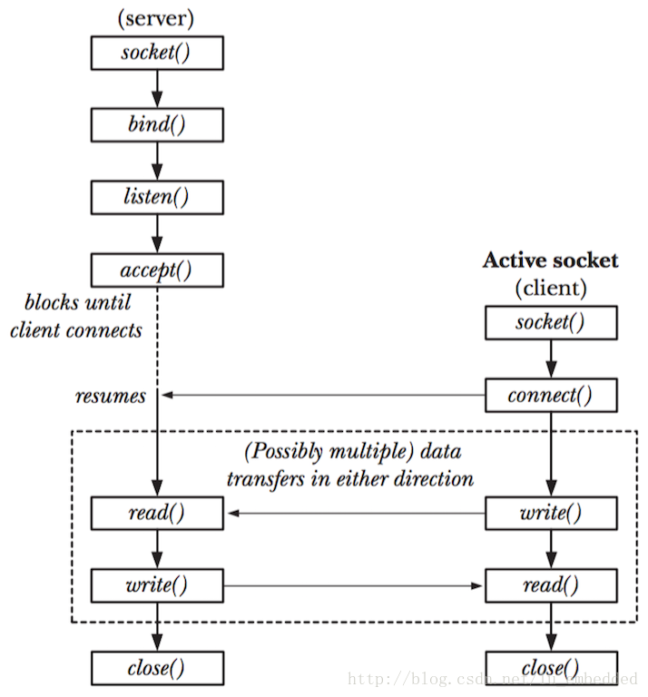

# 看代码时的拓展

## Fork()

创建进程，两个进程代码完全一致，但是传入的初始参数或者传入的变量不同，两个进程就可以做不同的事情。（从fork()调用时把后面所有的代码复制到新进程）

fork()在父进程时返回子进程的ID， 子进程fork()返回0：进程形成了链表，父进程的fpid(p 意味point)指向子进程的进程id，因为子进程没有子进程，所以其fpid为0。

## 守护进程（Daemon Process）

### 什么是守护进程？

[守护进程（Daemon Process）](http://baike.baidu.com/link?url=IcWqjC9d2Seh1YbNmbv4RdTbQ6PHDjQrqU1mxoTCalSOGlTm1ehoJIYnxVEgAqTDByUfSlH7rMdat00N1IKJva)，也就是通常说的 Daemon 进程（精灵进程），是 Linux 中的后台服务进程。它是一个生存期较长的进程，通常独立于控制终端并且周期性地执行某种任务或等待处理某些发生的事件。

[守护进程](http://baike.baidu.com/link?url=IcWqjC9d2Seh1YbNmbv4RdTbQ6PHDjQrqU1mxoTCalSOGlTm1ehoJIYnxVEgAqTDByUfSlH7rMdat00N1IKJva)是个特殊的[孤儿进程](http://blog.csdn.net/tennysonsky/article/details/45969569)，这种进程脱离终端，**为什么要脱离终端呢？**之所以脱离于终端是为了避免进程被任何终端所产生的信息所打断，其在执行过程中的信息也不在任何终端上显示。由于在 Linux 中，每一个系统与用户进行交流的界面称为终端，每一个从此终端开始运行的进程都会依附于这个终端，这个终端就称为这些进程的控制终端，当控制终端被关闭时，相应的进程都会自动关闭。

**Linux 的大数服务器**就是用守护进程实现的。比如，Internet 服务器 inetd，Web 服务器 httpd 等。

### 如何查看守护进程

在终端敲：`ps axj`

- a 表示不仅列当前用户的进程，也列出所有其他用户的进程
- x 表示不仅列有控制终端的进程，也列出所有无控制终端的进程
- j 表示列出与作业控制相关的信息

- 守护进程基本上都是以超级用户启动（ UID 为 0 ）
- 没有控制终端（ TTY 为 ？）
- 终端进程组 ID 为 -1 （ TPGID 表示终端进程组 ID）

### 编写守护进程

1）**屏蔽一些控制终端操作的信号**

这是为了防止守护进行在没有运行起来前，控制终端受到干扰退出或挂起。关于信号的更详细用法，[请看《信号中断处理》](http://blog.csdn.net/lianghe_work/article/details/46804469)。

2）**在后台运行**

这是为避免挂起控制终端将守护进程放入后台执行。方法是在进程中调用 fork() 使父进程终止， 让守护进行在子进程中后台执行。

3）**脱离控制终端、登录会话和进程组**

有必要先介绍一下 Linux 中的**进程与控制终端，登录会话和进程组之间的关系**：进程属于一个进程组，进程组号（GID）就是进程组长的进程号（PID）。登录会话可以包含多个进程组。这些进程组共享一个控制终端。这个控制终端通常是创建进程的 shell 登录终端。 控制终端、登录会话和进程组通常是从父进程继承下来的。**我们的目的就是要摆脱它们 ，使之不受它们的影响**。因此需要调用 `setsid()` 使子进程成为新的会话组长，示例代码如下：

`setsid()` 调用成功后，进程成为新的会话组长和新的进程组长，并与原来的登录会话和进程组脱离。由于会话过程对控制终端的独占性，进程同时与控制终端脱离。

4）**禁止进程重新打开控制终端**

现在，进程已经成为无终端的会话组长，**但它可以重新申请打开一个控制终端**。可以通过使进程不再成为会话组长来禁止进程重新打开控制终端，采用的方法是再次创建一个子进程

5）**关闭打开的文件描述符**

进程从创建它的父进程那里继承了打开的文件描述符。如不关闭，将会浪费系统资源，造成进程所在的文件系统无法卸下以及引起无法预料的错误。

6）**改变当前工作目录**

进程活动时，其工作目录所在的文件系统不能卸下。一般需要将工作目录改变到根目录。对于需要转储核心，写运行日志的进程将工作目录改变到特定目录如 `/tmp`。

7）**重设文件创建掩模**

进程从创建它的父进程那里继承了文件创建掩模。它可能修改守护进程所创建的文件的存取权限。为防止这一点，将文件创建掩模清除：

8）**处理 SIGCHLD 信号**

但对于某些进程，特别是服务器进程往往在请求到来时生成子进程处理请求。如果父进程不等待子进程结束，子进程将成为僵尸进程（zombie）从而占用系统资源（关于僵尸进程的更多详情，[请看《僵尸进程》](http://blog.csdn.net/lianghe_work/article/details/46803445)）。如果父进程等待子进程结束，将增加父进程的负担，影响服务器进程的并发性能。在 Linux 下可以简单地将 SIGCHLD 信号的操作设为 SIG_IGN 。关于信号的更详细用法，[请看《信号中断处理》](http://blog.csdn.net/lianghe_work/article/details/46804469)。

## C 语言

### C 库函数 - memcpy()

```
void *memcpy(void *str1, const void *str2, size_t n)
```

### C 库宏 - assert()

C 库宏 `void assert(int expression)` 允许诊断信息被写入到标准错误文件中。换句话说，它可用于在 C 程序中添加诊断。

**expression** -- 这可以是一个变量或任何 C 表达式。如果 **expression** 为 TRUE，assert() 不执行任何动作。如果 **expression** 为 FALSE，assert() 会在标准错误 stderr 上显示错误消息，并中止程序执行。

### typedef特殊用法：typedef void* (*fun)(void*)

定义一个函数指针MyFun，它指向一个返回类型为int，有一个整型的参数的函数 

`int (*MyFun)(int);`

定义一个函数指针类型MYFUN，它定义的对象指向一个返回类型为int，有一个整型的参数的函数 

`typedef int (*MYFUN)(int);`

定义一个函数指针类型MYFUN，它定义的对象指向一个返回类型为void，有一个void*类型的参数的函数*

* `typedef void (*MYFUN)(void*);` 

### C enum(枚举)

```
enum　枚举名　{枚举元素1,枚举元素2,……};
```

**注意：**第一个枚举成员的默认值为整型的 0，后续枚举成员的值在前一个成员上加 1。我们在这个实例中把第一个枚举成员的值定义为 1，第二个就为 2，以此类推。（如果中间某个定义了，那么后面的从这个开始加一加一）

### C 库函数 - signal()

C 库函数 **void (\*signal(int sig, void (\*func)(int)))(int)** 设置一个函数来处理信号，即带有 **sig** 参数的信号处理程序。

```
void (*signal(int sig, void (*func)(int)))(int)
```

## 套接字（Socket）网络编程

#### Unix 本地套接字

socket API 原本就是为多台主机之间网络通信设计的，并且这种网络 socket 同样支持单台主机上的进程间通信，当然这样做的话，仍然需要 IP 地址和端口号（通过 loopback 地址 127.0.0.1）。Unix本地套接字，其实就是一种专门用于本地（也就是单个主机上的）网络通信的一种方法，它所用的 API 跟我们之前用的网络 socket API 是一样的。

虽然在很多教材中经常把Unix本地套接字放在网络编程里面进行讲解，但实际上，这种通信方式更类似于我们之前所学的IPC（进程间通信）的方式，比如无名管道（pipe）、有名管道（mkfifo）。但是，Unix域套接字所提供的控制方式会更多一些，比如说TCP（字节流套接字）提供等待连接的功能，UDP（数据报套接字）提供帧同步功能，同时也是全双工的（比如使用 **socketpair** 创建的流管道中的两个描述符都是既可读又可写的）。

​											 TCP                                                                                       UDP



1. **创建套接字**

   首先是 socket 的创建。同样使用 socket() 这个函数。

2. **绑定地址**

   创建完套接字，接下来就是通过 bind() 函数绑定地址，但对于 Unix 本地套接字来说，绑定的地址就不是原来的“IP地址 + 端口号”了，而是一个有效的路径。

3. **其他API**

   其他的一些 API，比如 listen()、accept()、connect()，以及数据通信用的 read()、write()、recv()、send()、recvfrom()、sendto()、recvmsg()、sendmsg()，用法跟网络 socket 基本一样，主要是地址结构体需要注意一下

## MPU和MCU的区别

MPU的全称叫Micro Processor Unit，MCU的全称是Micro Controller Unit。

MCU一般根据外界信号产生一些响应，做一点简单的人机界面（主频要求不怎么高）

MPU就是处理器（微型化/集成化的“中央处理器”）这就是把传统的CPU之外集成了原属于“芯片组”的各类接口和部分“外设”而形成的。MPU由于需要运行对处理能力要求复杂大程序，一般都需要外挂存储器才能运行起来，而MCU往往只是执行刺激-响应式的过程控制和辅助，功能比较单一，仅仅需要使用片上集成的小存储器即可。

总结一下，MPU和MCU的区别本质上是因为应用定位不同，为了满足不同的应用场景而按不同方式优化出来的两类器件。MPU注重通过较为强大的运算/处理能力，执行复杂多样的大型程序，通常需要外挂大容量的存储器。而MCU通常运行较为单一的任务，执行对于硬件设备的管理/控制功能。通常不需要很强的运算/处理能力，因此也不需要有大容量的存储器来支撑运行大程序。通常以单片集成的方式在单个芯片内部集成小容量的存储器实现系统的“单片化”。


